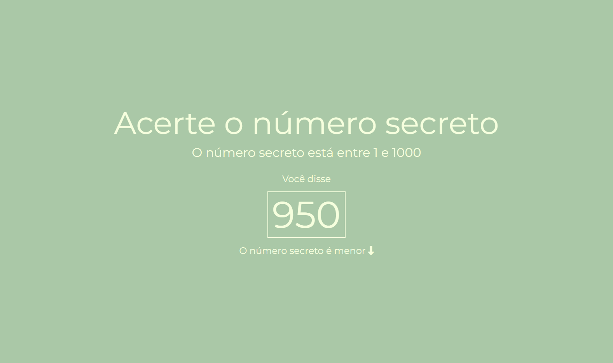
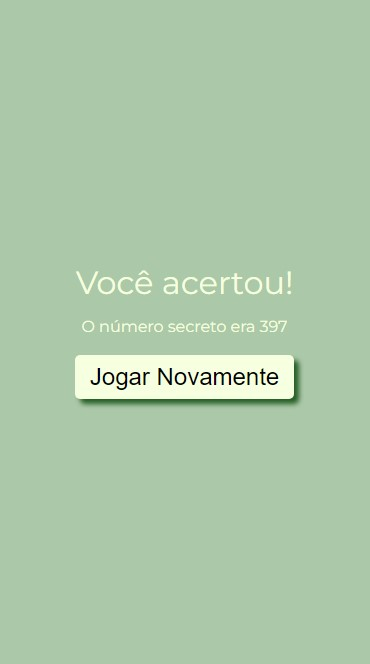

<p align="center">
   
</p>

## Este curso abordou os seguintes tópicos:  
```
•	Iniciamos o desenvolvimento do jogo de reconhecimento de voz com JavaScript do zero;  
•	Estruturamos a página do jogo com HTML;  
•	Escolhemos a fonte, as cores e estilizamos toda parte visual;  
•	Criamos a pasta para manter todo código JavaScript, fizemos o import do script no HTML, e criamos a escolha de um número pseudo-aleatório;  
•	Manipulamos o menor e o maior valor de forma dinâmica, modificando o conteúdo do HTML através do JavaScript;  
•	Utilizamos o Web Speech API para realizar o reconhecimento de voz do nosso jogo;  
•	Aprendemos como manipular os dados de voz reconhecidos;  
•	Vimos como exibir o que foi falado na tela;  
•	Utilizamos o Web Speech API para realizar o reconhecimento de voz do nosso jogo;  
•	Aprendemos como manipular os dados de voz reconhecidos;  
•	Vimos como exibir o que foi falado na tela;  
•	Aprendemos como validar os dados de entrada de áudio;  
•	Criamos a tela de sucesso, caso o chute seja igual ao número secreto;  
•	Adicionamos informações caso o dado de entrada seja válido, porém, diferente do objetivo;  
•	Para melhorar a experiência de quem for jogar, criamos um botão para jogar novamente na tela de acerto;  
•	Colocamos o jogo no GitHub e publicamos através da Vercel;  
```


## Imagem Desktop e Mobile / Minha Versão
  
  
